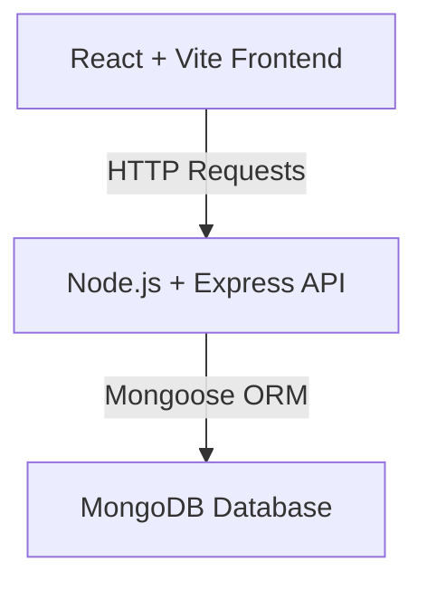
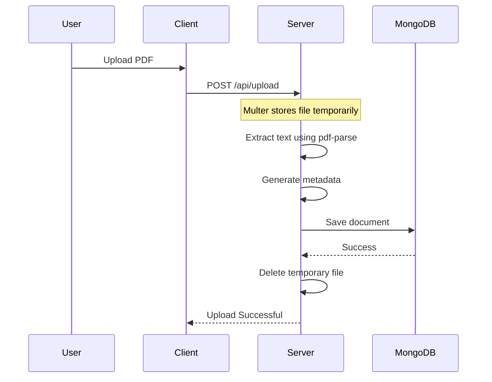

# 🔎 Search Knowledge Repository

A full-stack **MERN** application for fast and efficient searching, uploading, and browsing of organizational documents and media. The application provides a centralized knowledge repository with full-text search, metadata filtering, PDF text extraction, and an interactive document viewer.

---

## 📖 Overview

The **Search Knowledge Repository** enables users to quickly discover information across unstructured documents stored within an organization. Documents are uploaded, processed, indexed, and made searchable through a modern, responsive web interface.

### ✨ Features

- 🔍 Full-text document search
- 📄 PDF upload with automatic text extraction
- 🏷 Dynamic metadata storage
- ⚡ AND / OR search modes
- 🎯 Keyword highlighting
- 🌙 Modern dark-themed UI
- 📱 Responsive design
- 🚀 MongoDB text indexing for fast searches

---

# 🛠 Tech Stack

## Frontend

- React (Vite)
- Tailwind CSS
- Framer Motion
- Lucide React

## Backend

- Node.js
- Express.js
- Multer
- pdf-parse

## Database

- MongoDB
- Mongoose

---

# 🏗 System Architecture



---

# 📂 Database Design

The application uses a flexible **documents** collection.

| Field | Description |
|--------|-------------|
| `filename` | Name of the uploaded document |
| `file_type` | PDF, DOCX, Image, CAD, Video, etc. |
| `metadata` | Dynamic key-value metadata |
| `extracted_text` | Parsed text extracted from the document |

Example document:

```json
{
  "filename": "Pipeline_Report.pdf",
  "file_type": "PDF",
  "metadata": {
    "department": "Production",
    "author": "John Doe",
    "upload_date": "2025-01-10",
    "tags": ["Pipeline", "Inspection"]
  },
  "extracted_text": "Complete OCR extracted content..."
}
```

---

# ⚙ Backend Workflow

The backend exposes two primary routes:

```
POST /api/search
POST /api/upload
```

## Search Logic

The search query is split into keywords before building MongoDB queries.

### Match Any (OR)

Returns documents where **any keyword** appears in:

- filename
- extracted_text

```javascript
{
  $or: [
    { filename: /keyword/i },
    { extracted_text: /keyword/i }
  ]
}
```

### Match All (AND)

Returns only documents containing **every keyword**.

```javascript
{
  $and: [
    {
      $or: [
        { filename: /keyword1/i },
        { extracted_text: /keyword1/i }
      ]
    },
    {
      $or: [
        { filename: /keyword2/i },
        { extracted_text: /keyword2/i }
      ]
    }
  ]
}
```

---

# 📤 Upload Workflow



---

# 🎨 Frontend Features

## 🔍 Search Dashboard

- Elegant centered search bar
- Toggle between AND / OR search
- Responsive layout
- Smooth animations

## 📄 Upload Modal

- Drag & upload PDF
- Department selection
- Framer Motion animations

## 📋 Results Grid

Displays:

- File type icon
- Filename
- Metadata tags
- Preview snippet
- Hover animations

## 📖 Document Viewer

- Full-screen modal
- Displays extracted document text
- Dynamic keyword highlighting
- Safe rendering without `dangerouslySetInnerHTML`

---

# 📁 Project Structure

```text
ONGC Project
│
├── backend
│   ├── models
│   │   └── Document.js
│   ├── uploads
│   ├── server.js
│   ├── seed.js
│   ├── insert_cv.js
│   ├── package.json
│   └── .env
│
├── frontend
│   ├── src
│   │   ├── App.jsx
│   │   ├── SearchDashboard.jsx
│   │   ├── ResultsGrid.jsx
│   │   ├── main.jsx
│   │   └── index.css
│   ├── package.json
│   ├── vite.config.js
│   ├── tailwind.config.js
│   └── postcss.config.js
│
└── README.md
```

---

# 🚀 Installation

## Prerequisites

Make sure the following are installed:

- Node.js (v18 or later)
- MongoDB
- Git

---

## 1️⃣ Clone Repository

```bash
git clone https://github.com/Prathmesh-ally/ONGC-Nexus.git
cd "ONGC Project"
```

---

## 2️⃣ Backend Setup

Navigate to backend:

```bash
cd backend
```

Install dependencies:

```bash
npm install
```

Create a `.env` file:

```env
PORT=5000
MONGODB_URI=mongodb://127.0.0.1:27017/ongc_nexus
```

Start the server:

```bash
node server.js
```

or

```bash
npm run dev
```

Backend will run at:

```
http://localhost:5000
```

---

## 3️⃣ Frontend Setup

Open a new terminal.

```bash
cd frontend
```

Install dependencies:

```bash
npm install
```

Start the development server:

```bash
npm run dev
```

Frontend runs at:

```
http://localhost:5173
```

---

## 4️⃣ Database Seeding (Optional)

Populate the database with sample documents.

```bash
cd backend

node seed.js
```

or

```bash
node insert_cv.js
```

---

# 📡 API Endpoints

## Upload Document

```
POST /api/upload
```

Uploads a PDF, extracts text, stores metadata, and saves it to MongoDB.

---

## Search Documents

```
POST /api/search
```

Example request:

```json
{
  "query": "pipeline inspection",
  "mode": "OR"
}
```

---

# ⚡ Search Optimization

A **Compound Text Index** is created on:

- `extracted_text`
- `metadata`

This enables:

- Fast full-text searches
- Better scalability
- Efficient querying of large document collections

---

# 🚀 Future Enhancements

- OCR for scanned PDFs
- Image OCR support
- Video transcription
- AI-powered semantic search
- Document summarization
- Authentication & Authorization
- Department-wise access control
- Elasticsearch integration
- Cloud Storage (AWS S3 / Azure Blob)
- Recent searches
- Search history
- Document versioning
- Multi-language support

---

# 📷 Screenshots

## Dashboard

> Add your screenshot here

```text
docs/dashboard-preview.png
```

---

# 📄 License

This project is licensed under the **MIT License**.

---

# 👨‍💻 Author

**Prathmesh**

GitHub: https://github.com/Prathmesh-ally
