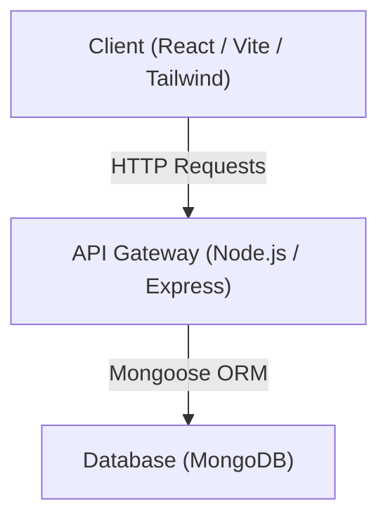
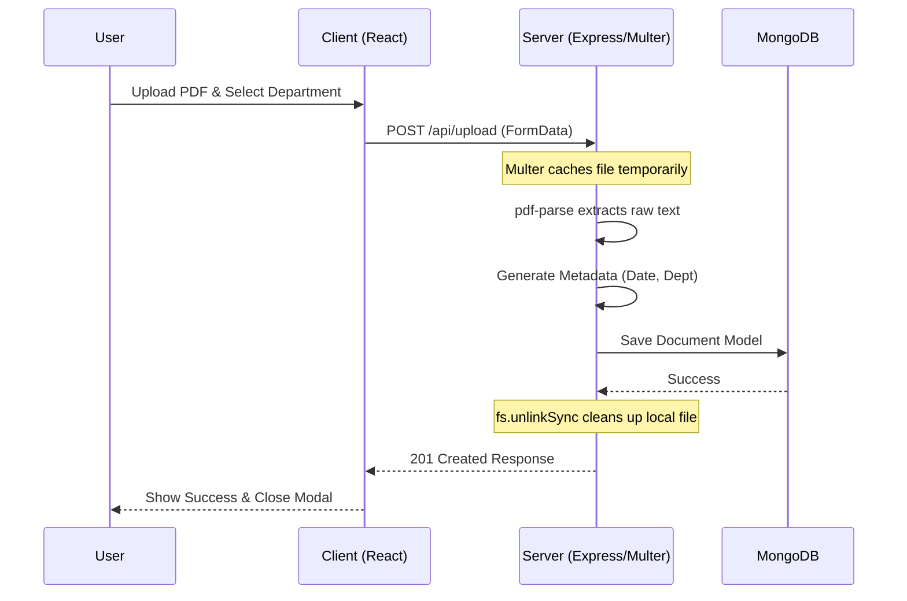

# Search Knowledge Repository


## Project Overview
The Search Knowledge Repository is a full-stack web application built to instantly query, browse, and view unstructured organizational documents and media. It provides a centralized platform to efficiently search through a diverse range of assets, making knowledge discovery seamless and lightning-fast.

## Architecture Stack
This project leverages the modern MERN stack to deliver a robust, fast, and responsive user experience:
- **Frontend:** React (Vite), Tailwind CSS (for highly customizable styling), Framer Motion (for smooth animations and micro-interactions), and Lucide-React (for clean iconography).
- **Backend:** Node.js and Express.js (handling API routing and server logic).
- **Database:** MongoDB (using Mongoose for object data modeling).

### Figure 1: System Architecture Diagram


## Database Design
Our database is streamlined around a single, highly flexible `documents` collection. Each document contains the following core fields:
- `filename`: The name of the file or asset.
- `file_type`: The format of the file (e.g., PDF, Image, Word, CAD, Video).
- `metadata`: A mixed data type object containing key-value pairs of dynamic metadata (like author, resolution, tags, department, upload date).
- `extracted_text`: A raw string containing all the text extracted from the document via OCR, parsing, or transcription.

To ensure lightning-fast queries across massive amounts of text, a **Compound Text Index** is applied specifically to the `extracted_text` and `metadata` fields.

## Backend Workflow
The core of the backend relies on two major routes: `POST /api/search` and `POST /api/upload`.

### Search Logic (`/api/search`)
When a user submits a query, the search string is split into individual keyword tokens. The backend builds dynamic MongoDB queries using an internal `$or` condition to check both `filename` and `extracted_text` simultaneously.
- **Match Any (OR):** Uses an outer `$or` array to return documents where any word hits either field.
- **Match All (AND):** Uses an outer `$and` array to strictly enforce that every single keyword typed exists somewhere in the document's title or content.

### Figure 2: Upload & Extraction Workflow (`/api/upload`)
The backend features a robust file upload pipeline utilizing `multer` for multipart form data and `pdf-parse` for automated raw text extraction.



## Frontend Workflow
The user interface focuses on a premium, dark-themed corporate aesthetic. Key UI features include:
- **Search Dashboard:** A beautifully centered, sleek search bar featuring a glowing focus state and an intuitive toggle switch for transitioning between "OR" and "AND" search logic.
- **Upload Modal:** A fluid, spring-animated Framer Motion overlay enabling users to classify incoming PDFs by ONGC Departments prior to ingestion.
- **Results Grid:** A responsive, data-dense grid of cards displaying the file type icon, document name, metadata pills, and text snippets. It features deep hover animations and crisp borders.
- **Document Viewer Modal:** An interactive full-screen overlay that pops up when a document card is clicked. It presents the entire `extracted_text` string using elegant, readable typography.
- **Dynamic Keyword Highlighting:** The viewer utilizes a custom React parsing function to read the active search query and wrap matched keywords inside stylized highlight tags (using regex) on the fly—ensuring perfectly safe rendering without relying on `dangerouslySetInnerHTML`.

## Project Structure
```text
ONGC Project
├── backend
│   ├── models
│   │   └── Document.js
│   ├── uploads/            # Temporary file storage via Multer
│   ├── .env
│   ├── insert_cv.js
│   ├── package.json
│   ├── seed.js
│   └── server.js
├── frontend
│   ├── src
│   │   ├── App.jsx
│   │   ├── index.css
│   │   ├── main.jsx
│   │   ├── ResultsGrid.jsx
│   │   └── SearchDashboard.jsx
│   ├── index.html
│   ├── package.json
│   ├── postcss.config.js
│   ├── tailwind.config.js
│   └── vite.config.js
└── README.md
```
